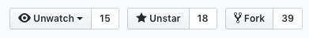
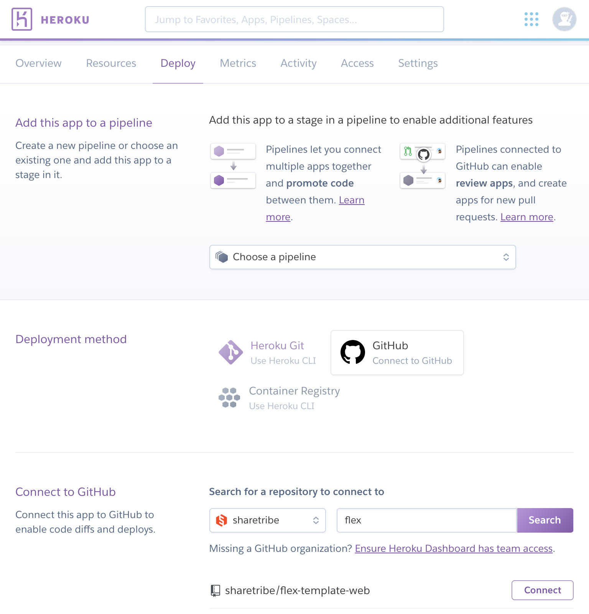
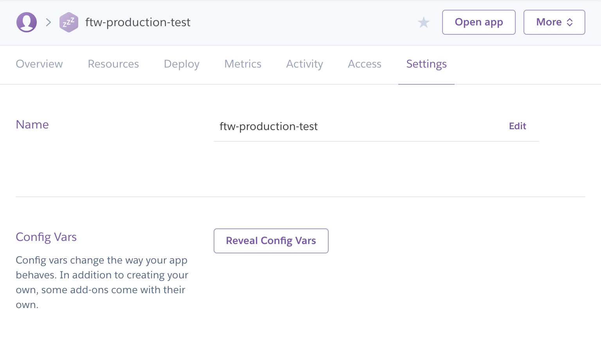
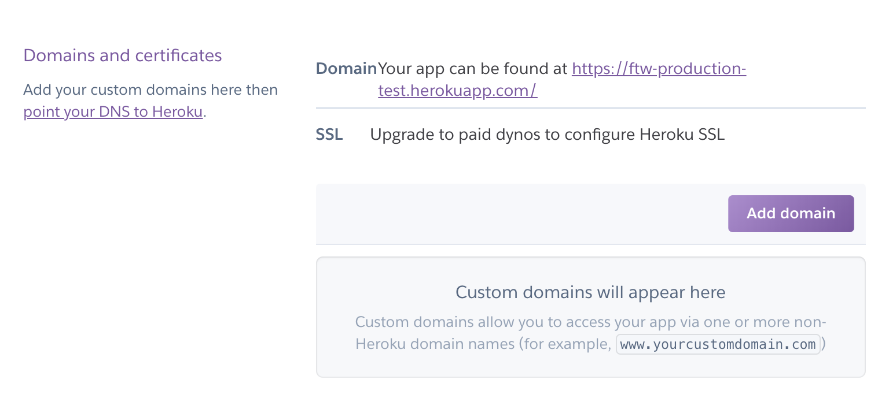
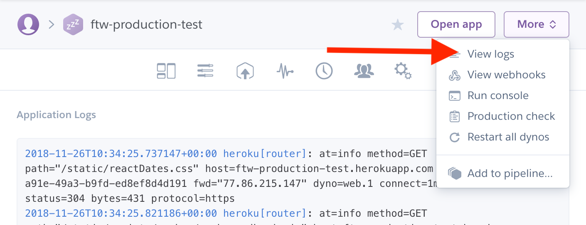

# Deploying to production

## Getting started

The easiest way to get started is deploying the application to Heroku. Before creating the app you
need three accounts: [Heroku](https://heroku.com/), [Stripe](https://stripe.com/) and
[MapBox](https://www.mapbox.com/). Creating the accounts is free unless you start heavily using
them.

Read more from [detailed Heroku instructions](#deploying-to-heroku) with a deploy-to-Heroku button.

In other production environments, make sure that you have [Node.js](https://nodejs.org/) and
[Yarn](https://yarnpkg.com/) installed. You will also need accounts to Stripe and MapBox.

After this you need to do the following steps:

1.  [Set environment variables](#enviroment-variables)
2.  [Build the app](#building-the-app)
3.  [Run the node server](#starting-the-app)

### Enviroment variables

To deploy the application add at least the following variables:

| Variable                             | Description                                                                                                                                                                                                                                                                                       |
| ------------------------------------ | ------------------------------------------------------------------------------------------------------------------------------------------------------------------------------------------------------------------------------------------------------------------------------------------------- |
| `NODE_ENV`                           | Use value 'production' for production.                                                                                                                                                                                                                                                            |
| `PORT`                               | Must be set if the production environment doesn't set it by default. Not needed in Heroku.                                                                                                                                                                                                        |
| `REACT_APP_SHARETRIBE_SDK_CLIENT_ID` | Client ID (API key) you can check from [Flex Console](https://flex-console.sharetribe.com/login/). You will get this from the Sharetribe team.                                                                                                                                                    |
| `REACT_APP_STRIPE_PUBLISHABLE_KEY`   | Stripe publishable API key for generating tokens with Stripe API. It can be found from Stripe [API keys](https://dashboard.stripe.com/account/apikeys) page. Make sure to toggle _"View test data"_ on if you don't want to use real money yet. The secret key needs to be added to Flex Console. |
| `REACT_APP_MAPBOX_ACCESS_TOKEN`      | Sign up for Mapbox and go to [account page](https://www.mapbox.com/account/access-tokens). Then click `Create access token`. For more information see the [Integrating to map providers](./map-providers.md) documentation.                                                                       |
| `REACT_APP_CANONICAL_ROOT_URL`       | Canonical root URL of the marketplace. E.g. https://the-name-of-your-app.herokuapp.com or your actual domain. This is needed for social media sharing and SEO optimization.                                                                                                                       |

There are also some other variables that can be used. See the
[Enviroment configuration variables](./env.md) documentation for more information.

### Building the app

Running the following command builds the app for production to the build folder. It correctly
bundles React in production mode and optimizes the build for the best performance.

`yarn build`

After this, your app is ready to be deployed.

### Starting the app

Start the server:

`yarn start`

## Deploying to Heroku

- [Forking the repository](#forking-the-repository)
- [Creating new app](#creating-new-app)
- [Connect GitHub to Heroku](#connect-github-to-heroku)
- [Heroku settings](#heroku-settings)
  - [Updating enviroment variables](#updating-enviroment-variables)
  - [Domains and certificates](#domains-and-certificates)
- [Heroku logs](#heroku-logs)

Before creating the app you need three accounts: [Heroku](https://heroku.com/),
[Stripe](https://stripe.com/fi) and [MapBox](https://www.mapbox.com/). Creating the accounts is free
unless you start heavily using them.

### Forking the repository

When deploying to Heroku you should use a forked repository. This makes it possible to make
[manual deploys](https://devcenter.heroku.com/articles/github-integration#manual-deploys) after
changes to environment variables.

If you haven't done this already, you just need to click the "Fork" button on the top-right corner
of the page: 

Read more from [Customization guide](./customization-guide.md#fork-the-repository) for more
instructions.

### Creating a new app

The easiest way is to click the _"Deploy to Heroku"_ button (check the root folder in your forked
repository) and fill in the needed information.

After deploying you will find your app from your Heroku [dashboard](https://dashboard.heroku.com/).
If you click your application you will see Overview and some other tabs.

If you don't want to use the deploy button you can also manually create a new application in Heroku
dashboard but then you have to manually set all the environment variables. If you prefer using the
command line you can also use [Heroku CLI](https://devcenter.heroku.com/articles/git).

### Connect GitHub to Heroku

Connecting your GitHub account to Heroku makes it possible to do automatic and manual deploys in the
dashboard using GitHub branches.

1.  In Heroku dashboard go to _Deploy tab_ and find _Deployment method_ section.
2.  Click _Connect to GitHub_ button. After that, you will see _Connect to GitHub_ section.
3.  Search the repository you have forked to your account and click connect.

After this, you can enable automatic deploys from specific GitHub branch or do the manual deploy
from any branch in the repository.

Read more from Heroku docs:

- [GitHub Integration](https://devcenter.heroku.com/articles/github-integration)

### Heroku settings

In the _Settings tab_ you can manage your application's information, set it to maintenance mode and
delete the app if needed.

#### Updating enviroment variables

In the _Settings tab_ click _"Reveal Config Vars"_ button to see the applications environment
variables. Click edit to update them or add new ones if needed.

> **NOTE:** If you change these variables, you need to deploy the app again.

#### Domains and certificates

Heroku manages SSL certificates automatically for new applications. You can change your domain and
SSH settings in the _Settings tab_.

Read more from Heroku docs:

- [Custom Domain Names for Apps](https://devcenter.heroku.com/articles/custom-domains)
- [Manually Acquiring an SSL/TLS Certificate](https://devcenter.heroku.com/articles/acquiring-an-ssl-certificate)

### Heroku logs

You can find your application's logs by clicking button _"More"_ in the upper right corner and
selecting _"View logs"_ from the opening dropdown. Logs can be useful if there are problems when
deploying the app.

