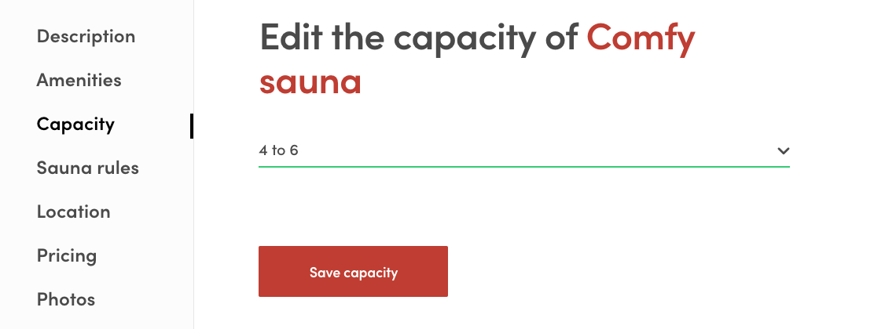
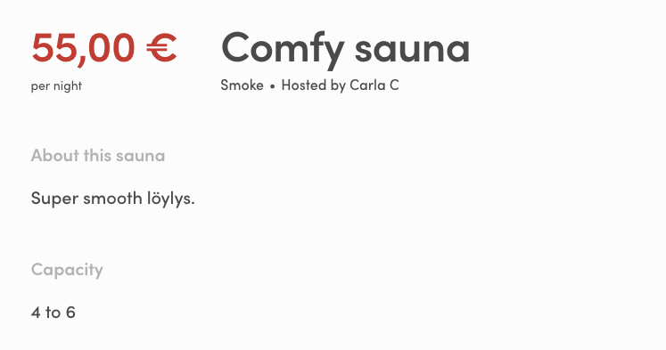

# Extend listing data

This guide walks you through the different steps required to expand the listing data model in your
marketplace. We'll have a look on how the data is added, how it can be presented and finally how it
can be used to filter searches.

Adding new attributes to the data model relies on a Flex concept called
[extended data](./extended-data.md).

Three main areas in extending the listing data model are:

- [Declare the attribute and it's possible values](#declare-the-attribute-and-its-possible-values)
- [Edit the listing wizard](#edit-the-listing-wizard)
- [Show the attribute on listing page](#show-the-attribute-on-listing-page)
- [Use the attribute as a search filter](#use-the-attribute-as-a-search-filter)

In this guide we will extend the listing data model by adding a _capacity_ attribute.

## Add a new attribute

### Declare the attribute and its possible values

So, you have come up with a great new extension to the listing data model, fantastic! Depending of
the type of data the new attribute is going to be used for it might make sense to define and store
the possible values for the attribute. In case the data will be free form text there might not be
use for this but in our case we wan't to fix the possible values that can be used for the capacity.
Also if the attribute will be used as a search filter it helps to keep track of the possible values
somewhere.

A commonly used way of storing the possible values for a listing attribute is to declare them in the
[marketplace-custom-config.js](../src/marketplace-custom-config.js) file. Place the values in an
array and export the variable containing the array. The exports from that file are included in the
`src/config.js` file and are available as properties in `config.custom`. Search filters and some
components used to edit and present the data rely on a data model of an array of objects that
contain `key` and `label` properties.

For the capacity attribute we'll define a set of values that describe the capacity in a few ranges
of how many people can fit into a given sauna:

```js
export const capacityOptions = [
  { key: '1to3', label: '1 to 3' },
  { key: '4to6', label: '4 to 6' },
  { key: '7to9', label: '7 to 9' },
  { key: '10plus', label: '10 plus' },
];
```

### Edit the listing wizard

Next step is to add means for modifying the attribute data in listings. This is achieved by adding
proper inputs to the `EditListingWizard`. It could probably make sense to add the input to the
_description_ tab or modify the _amenities_ tab to also include capacity but for the sake of clarity
let's add a new tab to the wizard. The new tab will be placed between the _amenities_ and _policy_
tabs.

First lets declare the tab in `EditListingWizardTab`:

```js
export const DESCRIPTION = 'description';
export const FEATURES = 'features';
export const CAPACITY = 'capacity';
export const POLICY = 'policy';
export const LOCATION = 'location';
export const PRICING = 'pricing';
export const PHOTOS = 'photos';

// EditListingWizardTab component supports these tabs
export const SUPPORTED_TABS = [DESCRIPTION, FEATURES, CAPACITY, POLICY, LOCATION, PRICING, PHOTOS];
```

Now in `EditListingWizard` we can take that tab declaration into use. Import the tab name variable
from `EditListingWizardTab` and add it to the `TABS` array.

```js
export const TABS = [DESCRIPTION, FEATURES, CAPACITY, POLICY, LOCATION, PRICING, PHOTOS];
```

Also remember to add a label for the tab in the `tabLabel` function:

```js
const tabLabel = (intl, tab) => {
  let key = null;
  if (tab === DESCRIPTION) {
    key = 'EditListingWizard.tabLabelDescription';
  } else if (tab === FEATURES) {
    key = 'EditListingWizard.tabLabelFeatures';
  } else if (tab === CAPACITY) {
    key = 'EditListingWizard.tabLabelCapacity';
  } else if (tab === POLICY) {
    key = 'EditListingWizard.tabLabelPolicy';
  } else if (tab === LOCATION) {
    key = 'EditListingWizard.tabLabelLocation';
  } else if (tab === PRICING) {
    key = 'EditListingWizard.tabLabelPricing';
  } else if (tab === PHOTOS) {
    key = 'EditListingWizard.tabLabelPhotos';
  }

  return intl.formatMessage({ id: key });
};
```

The `tabCompleted` function keeps track of which data the user has already provided in order to tell
which tabs are completed. As we will be storing the capacity information in the listing's _public
data_ property (see the [extended data](./extended-data.md) documentation for more info on different
extended data types) we shall look into that property when resolving whether the capacity tab has
alerady been completed or not:

```js
/**
 * Check if a wizard tab is completed.
 *
 * @param tab wizard's tab
 * @param listing is contains some specific data if tab is completed
 *
 * @return true if tab / step is completed.
 */
const tabCompleted = (tab, listing) => {
  const { description, geolocation, price, title, publicData } = listing.attributes;
  const images = listing.images;

  switch (tab) {
    case DESCRIPTION:
      return !!(description && title);
    case FEATURES:
      return !!(publicData && publicData.amenities);
    case CAPACITY:
      return !!(publicData && publicData.capacity);
    case POLICY:
      return !!(publicData && typeof publicData.rules !== 'undefined');
    case LOCATION:
      return !!(geolocation && publicData && publicData.location && publicData.location.address);
    case PRICING:
      return !!price;
    case PHOTOS:
      return images && images.length > 0;
    default:
      return false;
  }
};
```

Next task is to add form and panel components that render the capacity tab. As for the form, let's
create a `EditListingCapacityForm` component:

```js
import React from 'react';
import { arrayOf, bool, func, shape, string } from 'prop-types';
import { compose } from 'redux';
import { Form as FinalForm } from 'react-final-form';
import { intlShape, injectIntl, FormattedMessage } from 'react-intl';
import classNames from 'classnames';
import { propTypes } from '../../util/types';
import { Form, Button, FieldSelect } from '../../components';
import { required } from '../../util/validators';

import css from './EditListingCapacityForm.css';

export const EditListingCapacityFormComponent = props => (
  <FinalForm
    {...props}
    render={fieldRenderProps => {
      const {
        className,
        disabled,
        handleSubmit,
        intl,
        invalid,
        pristine,
        saveActionMsg,
        updated,
        updateError,
        updateInProgress,
        capacityOptions,
      } = fieldRenderProps;

      const capacityPlaceholder = intl.formatMessage({
        id: 'EditListingCapacityForm.capacityPlaceholder',
      });

      const errorMessage = updateError ? (
        <p className={css.error}>
          <FormattedMessage id="EditListingCapacityForm.updateFailed" />
        </p>
      ) : null;

      const capacityRequired = required(
        intl.formatMessage({
          id: 'EditListingCapacityForm.capacityRequired',
        })
      );

      const classes = classNames(css.root, className);
      const submitReady = updated && pristine;
      const submitInProgress = updateInProgress;
      const submitDisabled = invalid || disabled || submitInProgress;

      return (
        <Form className={classes} onSubmit={handleSubmit}>
          {errorMessage}

          <FieldSelect
            className={css.capacity}
            name="capacity"
            id="capacity"
            validate={capacityRequired}
          >
            <option value="">{capacityPlaceholder}</option>
            {capacityOptions.map(c => (
              <option key={c.key} value={c.key}>
                {c.label}
              </option>
            ))}
          </FieldSelect>

          <Button
            className={css.submitButton}
            type="submit"
            inProgress={submitInProgress}
            disabled={submitDisabled}
            ready={submitReady}
          >
            {saveActionMsg}
          </Button>
        </Form>
      );
    }}
  />
);

EditListingCapacityFormComponent.defaultProps = {
  selectedPlace: null,
  updateError: null,
};

EditListingCapacityFormComponent.propTypes = {
  intl: intlShape.isRequired,
  onSubmit: func.isRequired,
  saveActionMsg: string.isRequired,
  updated: bool.isRequired,
  updateError: propTypes.error,
  updateInProgress: bool.isRequired,
  capacityOptions: arrayOf(
    shape({
      key: string.isRequired,
      label: string.isRequired,
    })
  ).isRequired,
};

export default compose(injectIntl)(EditListingCapacityFormComponent);
```

The form component receives `capacityOptions` as a prop which are used to populate a `FieldSelect`
component for selecting the capacity. The `EditListingCapacityForm` is also added to the
`src/containers/index.js` file so that it can easilly be referenced from other components. To use
the capacity editing form we'll add a panel component which is then used in `EditListingWizardTab`
to render the wizard phase. This component we'll call `EditListingCapacityPanel`:

```js
import React from 'react';
import PropTypes from 'prop-types';
import classNames from 'classnames';
import { FormattedMessage } from 'react-intl';
import { ensureOwnListing } from '../../util/data';
import { ListingLink } from '../../components';
import { EditListingCapacityForm } from '../../containers';
import config from '../../config.js';

import css from './EditListingCapacityPanel.css';

const EditListingCapacityPanel = props => {
  const {
    className,
    rootClassName,
    listing,
    onSubmit,
    onChange,
    submitButtonText,
    panelUpdated,
    updateInProgress,
    errors,
  } = props;

  const classes = classNames(rootClassName || css.root, className);
  const currentListing = ensureOwnListing(listing);
  const { publicData } = currentListing.attributes;

  const panelTitle = currentListing.id ? (
    <FormattedMessage
      id="EditListingCapacityPanel.title"
      values={{ listingTitle: <ListingLink listing={listing} /> }}
    />
  ) : (
    <FormattedMessage id="EditListingCapacityPanel.createListingTitle" />
  );

  return (
    <div className={classes}>
      <h1 className={css.title}>{panelTitle}</h1>
      <EditListingCapacityForm
        className={css.form}
        initialValues={{ capacity: publicData.capacity }}
        onSubmit={values => {
          const { capacity } = values;
          const updateValues = {
            publicData: {
              capacity,
            },
          };
          onSubmit(updateValues);
        }}
        onChange={onChange}
        saveActionMsg={submitButtonText}
        updated={panelUpdated}
        updateError={errors.updateListingError}
        updateInProgress={updateInProgress}
        capacityOptions={config.custom.capacityOptions}
      />
    </div>
  );
};

const { func, object, string, bool } = PropTypes;

EditListingCapacityPanel.defaultProps = {
  className: null,
  rootClassName: null,
  listing: null,
};

EditListingCapacityPanel.propTypes = {
  className: string,
  rootClassName: string,

  // We cannot use propTypes.listing since the listing might be a draft.
  listing: object,

  onSubmit: func.isRequired,
  onChange: func.isRequired,
  submitButtonText: string.isRequired,
  panelUpdated: bool.isRequired,
  updateInProgress: bool.isRequired,
  errors: object.isRequired,
};

export default EditListingCapacityPanel;
```

In the panel component we check for an initial capacity value from the `public_data` property of the
listing. In the submit handler the new capacity value is stored in the same property. The updated
listing object is eventually passed to the `updateListingDraft` and `requestUpdateListing` functions
in the `EditListingDetails.duck.js` file where the data updates are handled. Respectively
`EditListingCapacityPanel` needs to be exported from `src/components/index.js` for easier access
from other files.

Now that we have the panel and the form all ready we can add the panel to the `EditListingWizardTab`
component. This is done by adding a new block to the `switch` structure that handles rendering the
correct panel:

```js
case CAPACITY: {
  const submitButtonTranslationKey = isNew
    ? 'EditListingWizard.saveNewCapacity'
    : 'EditListingWizard.saveEditCapacity';
  return (
    <EditListingCapacityPanel
      {...panelProps(CAPACITY)}
      submitButtonText={intl.formatMessage({ id: submitButtonTranslationKey })}
      onSubmit={values => {
        onCompleteEditListingWizardTab(tab, values);
      }}
    />
  );
}
```

There! Now we've extended the listing data model with capacity information.



The capacity data can now be added to new and existing listings. Next chapter describes how that
data can be presented in the listing page.

## Show the attribute on listing page

Next step in adding a new attribute to the listing is to present it in the listing page. On some
cases an extension to the listing data model can be used purely to enhance the application logic but
in our case with the capacity information we want to show the added attribute in the listing page
for potential customers.

To show the capacity attribute in the listing page, let's create a specific component for it and
place it in the `ListingPage` container. Desired outcome could also be achieved just by editing the
`ListingPage` but extracting the capacity UI parts into a separate component will simplify the
`ListingPage` and make possible upstream updates from the Flex web template repo easier as there's
less chances for merge conflicts. So, let's create a `SectionCapacity` component in the
`src/containers/ListingPage/` directory:

```js
import React from 'react';
import { array, shape, string } from 'prop-types';
import { FormattedMessage } from 'react-intl';

import css from './ListingPage.css';

const SectionCapacity = props => {
  const { publicData, options } = props;

  const capacity = publicData.capacity;
  const capacityOption = options.find(option => option.key === capacity);

  return capacityOption ? (
    <div className={css.sectionCapacity}>
      <h2 className={css.capacityTitle}>
        <FormattedMessage id="ListingPage.capacityTitle" />
      </h2>
      <p className={css.capacity}>{capacityOption.label}</p>
    </div>
  ) : null;
};

SectionCapacity.propTypes = {
  options: array.isRequired,
  publicData: shape({
    capacity: string,
  }).isRequired,
};

export default SectionCapacity;
```

Remember to add corresponding css definitions to `ListingPage.css` to get the styling right. Import
the component into `ListingPage` and place it inside the `<div className={css.mainContent}>`
element:

```js
import SectionCapacity from './SectionCapacity';
```

```js
<div className={css.mainContent}>
  {/* other sections */}

  <SectionCapacity publicData={publicData} options={capacityOptions} />

  {/* other sections */}
</div>
```

```js
ListingPageComponent.defaultProps = {
  // other default props
  capacityOptions: config.custom.capacityOptions,
};

ListingPageComponent.propTypes = {
  // other props
  capacityOptions: array,
};
```

In the snippet above, the capacity options are passed to the `ListingPage` as a property, with the
default property value pulling the options from the custom config (`marketplace-custom-config.js`).
This way the listing page test can define it's own capacity options that are in line with test data
used in the test and custom config changes will not affect test results.

And voilà, we have listing capacity presented in the listing page!



## Use the attribute as a search filter

To see how the capacity attribute can be used to filter search results, please refer to the
[search filters documentation](./search-filters.md).
