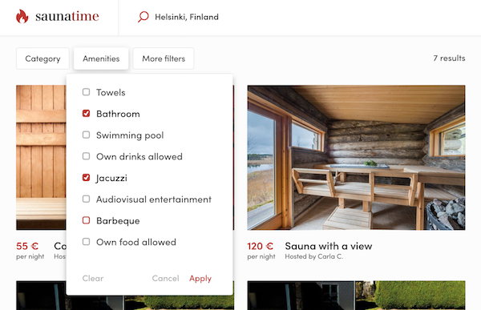
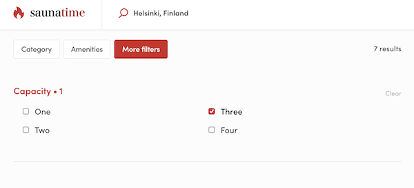
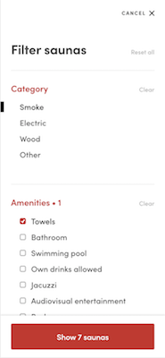

# Search filters

The search experience can be improved by adding search filters to narrow down the results. The
filters rely on listing's indexed data.

## Filter types

The Flex template for web has three different filter types: _price filter_, _select single_ and
_select multiple_. The _price filter_ is for the specific case of filtering listings with a price
range.

> NOTE: price filter should be configured from `src/marketplace-custom-config.js`. Current maximum
> value for the range is set to 1000 (USD/EUR).

Other two filter types can be used with extended data. The _select single_ one can be used to filter
out search result with only one value per search parameter. The _select multiple_ filters on the
other hand can take multiple values for a single search parameter. These two filter types for
extended data are implemented with four different components, a standard and a plain one:

- Select single filter: `SelectSingleFilter` and `SelectSingleFilterPlain`
- Select multiple filter: `SelectMultipleFilter` and `SelectMultipleFilterPlain`

The `SelectSingleFilter` and `SelectMultipleFilter` components are rendered as standard dropdowns in
the search view. The plain filter components `SelectSingleFilterPlain` and
`SelectMultipleFilterPlain` are used with `SearchFiltersMobile` and `SearchFiltersPanel` to provider
filters in mobile view or to open filters in a distinct panel in order to fit more filters to the
desktop search view.

## Adding a new search filter

Next we'll guide you through the steps of adding a _capacity_ filter to the marketplace.

First step for adding a new filter is to make sure that the data being used for filtering is saved
in the listing's `publicData` attribute. On how to achieve this, please refer to the
[documentation on extending the listing data model](./extend-listing.md). Another aspect in search
filters is that the public data needs to be indexed in the API. This is currently achieved with a
manual operation done by the Sharetribe support. Once a public data attribute is added to the
listings and the data attribute is indexed, the listing searches can be filtered by that attribute
by adding a query parameter that consists of a preceding "pub\_" and the attribute name, so for the
_capacity_ attribute the parameter would be "pub_capacity".

Further reading on public data can be found in the
[extended data documentation](./extended-data.md).

**NOTE:** Please contact the Sharetribe support in order to update your listing index schema when
planning to use new listing fields as search filters.

### Common changes

A few common changes are required to add a select single or a select multiple filter to desktop and
mobile views.

First of all, the value options for the filter need to be defined. One handy place to store these is
the `marketplace-custom-config.js` file. The correct format is a list of objects with `key` and
`label` fields:

```js
export const capacityOptions = [
  {
    key: 'oneToThree',
    label: '1 to 3',
  },
  {
    key: 'fourToSix',
    label: '4 to 6',
  },
  ...
];
```

A few changes need to be made to the `SearchPage` container in order to get the filters to work.

`SearchPage` needs the filter options. One handy way is to add the options as a prop to the
component and then set `defaultProps` value from `config.custom` (contains the
`marketplace-custom-config.js` exports). This way tests can pass in their own values for the filter
options and filter option changes won't affect tests.

```js
SearchPageComponent.defaultProps = {
  // other default props
  capacityOptions: config.custom.capacityOptions,
};

SearchPageComponent.propTypes = {
  // other props
  capacityOptions: array,
};
```

Also a filter configuration needs to be added to the object returned by the `filters` method. The
`filters` method combines query param name and options information of each filter so that those can
be passed on to subcomponents and used for validating the filter values and rendering the filter
components.

To add a filter configuration, extract the filter options from the props and set the param name as
the one defined in your extended data indexing configuration:

```js
filters() {
  const { capacityOptions } = this.props;

  return {
    capacityFilter: {
      paramName: 'pub_capacity',
      options: capacityOptions,
    },
    ...
  };
}
```

Final thing to do in `SearchPage` is to pass the filters configuration on to the components that
take care of rendering the filters. This is achieved by `primaryFilters` and `secondaryFilters`
props that are passed to `MainPanel`. The configurations are passed as an object in the same form as
the configuration object in `filters`.

```js
<MainPanel
  ...
  primaryFilters={{
    categoryFilter: filters.categoryFilter,
    amenitiesFilter: filters.amenitiesFilter,
  }}
  secondaryFilters={{
    capacityFilter: filters.capacityFilter,
  }}
/>
```

These props are used for resolving filter states and validating the filter values. The contents are
passed as props to the components that render the filters: `SearchFilters`, `SearchFiltersPanel` and
`SearchFiltersMobile` .The difference between filters passed as primary and secondary varies in
mobile and desktop views:

- **Desktop:** Primary filters are shown in the top of the search view, secondary filters are
  rendered in a distinct panel that opens on top of search results.
- **Mobile:** Both primary and secondary filters are rendered in the same modal.

### Desktop filters



A basic desktop filter that renders as a dropdown button on top of the search results panel is
achieved using the `SelectSingleFilter` and `SelectMultipleFilter` components. To add standard
desktop filters, perform the following in `SearchFilters` component:

- declare a prop with the same name that you added the filter config to `primaryFilters`
- resolve the filters initial value with `initialValue` and `initialValues` functions
- render the filter by using a `SelectSingleFilter` or `SelectMultipleFilter` component inside the
  `<div className={css.filters}>` element

### Desktop filters panel



If more filters are required than can fit into the top filter bar, the `SearchFiltersPanel`
component can be used. It renders as a button in the top filter bar that opens a new panel that can
contain a set of filters.

To use the `SearchFiltersPanel`, do the following:

- declare a prop with the same name that you added the filter config to `secondaryFilters`
- resolve the filters initial value with `initialValue` and `initialValues` methods
- use the `SelectSingleFilterPlain` and `SelectMultipleFilterPlain` components inside the
  `<div className={css.filtersWrapper}>` element to render the filters

### Mobile filters



The mobile view uses the same `SelectSingleFilterPlain` and `SelectMultipleFilterPlain` components
as the filter panel. In this case the filter components are declared in `SearchFiltersMobile`. The
following steps are required to add a mobile filter:

- declare a prop with the same name that you added the filter config to `primaryFilters` or
  `secondaryFilters`
- resolve the filters initial value with `initialValue` and `initialValues` methods
- use the `SelectSingleFilterPlain` and `SelectMultipleFilterPlain` components inside the
  `<div className={css.filtersWrapper}>` element to render the filters
